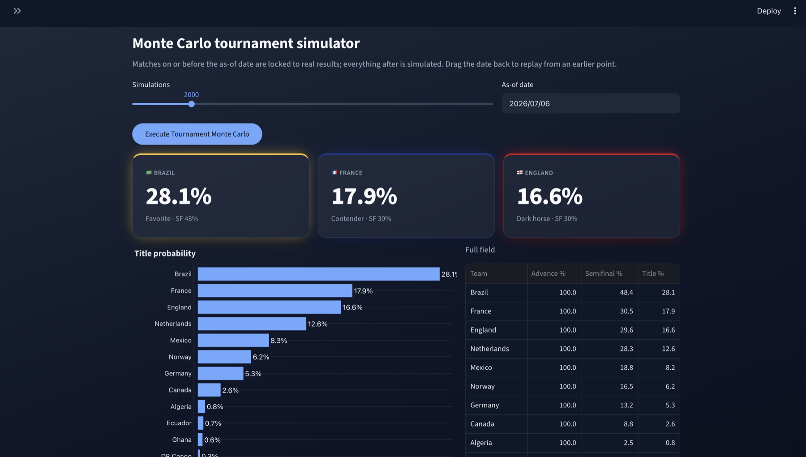

# World Cup 2026 Match Predictor & Tournament Simulator

Predicts international football results from a custom Elo rating system, then simulates
the 2026 World Cup thousands of times to estimate each team's chance of advancing,
reaching the semifinals, and winning the tournament. Ships as an interactive Streamlit
dashboard.

Built on 49,495 international matches (1872–2026) covering 336 national teams.



## What it does

**Match predictor** — win/draw/loss probabilities for any two national teams, with
current Elo ratings and recent form.

**Tournament simulator** — runs the full 48-team bracket up to 10,000 times and reports
per-team advancement, semifinal, and title probabilities. Matches played on or before a
chosen *as-of* date are locked to their real results and everything after is simulated,
so the tournament can be replayed from any point.

**Historical vault** — each nation's World Cup record: appearances, W/D/L, goals, win
rate, and goals per edition.

## Model performance

Evaluated on a chronological holdout — the most recent 10% of matches (4,950 games from
October 2021 onward), with the model trained only on matches before that date.

| Metric | Model | Baseline |
| --- | --- | --- |
| Accuracy | **61.1%** | 48.8% (always predict home win) |
| Log loss | **0.873** | 1.040 (class priors) |

Outcomes are imbalanced — 49.7% home wins, 28.9% away wins, 21.4% draws — so accuracy
alone is misleading. The log loss improvement over predicting base rates is the more
meaningful number.

## How it works

```
Kaggle results feed
      ↓  data_prep.py     clean matches, resolve knockout draws via penalty shootouts
      ↓  elo.py           walk matches chronologically, record pre-match ratings
      ↓  train_model.py   Random Forest on [home_elo, away_elo, neutral_venue]
      ↓  predictor.py     cached prediction interface
      ↓  simulator.py     Monte Carlo over the 2026 bracket
      ↓  app.py           Streamlit dashboard
```

**Elo system.** Ratings start at 1500 and update after every match. The K-factor scales
with tournament importance (World Cup, Euros, and Copa América at 60; qualifiers at 40;
everything else at 30) and with margin of victory. Home teams get a 100-point advantage
in the expected-score calculation, skipped for neutral venues.

Ratings are recorded *before* each match is played, so a training row never contains
information derived from the result it's predicting.

**Model.** A Random Forest (300 trees, max depth 8, min leaf size 20) over three
features: both pre-match Elo ratings and a neutral-venue flag. Outputs calibrated
three-way probabilities.

**Simulator.** The 12 groups are reconstructed from the fixture list using a graph
connected-components pass, and the Round-of-32 bracket skeleton is rebuilt from the real
fixtures, so the played portion of the tournament reproduces reality exactly. Group games
can draw; knockout ties are resolved by a rating-weighted penalty shootout. Match
predictions are memoized, since a 10,000-run simulation hits the same matchups repeatedly.

## Setup

Requires Python 3.11 or newer.

```bash
git clone https://github.com/pragyan-varma/mydatascience_project.git
cd mydatascience_project
python3 -m venv venv && source venv/bin/activate
pip install -r requirements.txt
```

The dataset comes from Kaggle, which needs API credentials. Create a token at
**kaggle.com → Settings → API → Create New Token**, then:

```bash
mkdir -p ~/.kaggle && mv ~/Downloads/kaggle.json ~/.kaggle/
chmod 600 ~/.kaggle/kaggle.json
```

Then download the data, train the model, and launch:

```bash
python src/refresh_data.py    # pulls ~50k matches from Kaggle
python src/train_model.py     # trains and saves models/match_predictor.pkl
streamlit run app.py
```

The dashboard sidebar also has a one-click button to re-pull the latest results and
retrain in place.

## Project structure

```
app.py              Streamlit dashboard (3 tabs)
src/
  refresh_data.py   pulls the dataset from Kaggle
  data_prep.py      cleaning, shootout resolution, result labelling
  elo.py            Elo rating engine
  train_model.py    trains the Random Forest, writes the model artifact
  predictor.py      cached prediction interface used by the app and simulator
  predict.py        batch predictions for upcoming fixtures
  simulator.py      Monte Carlo tournament simulator
  history.py        historical World Cup aggregations
  constants.py      team colors and flags for the UI
data/               raw and processed datasets (gitignored)
models/             trained model artifact (gitignored)
```

Datasets and the trained model aren't committed — both are regenerated by the two
commands above.

## Limitations

The model uses three features, so most of its predictive power comes from the Elo
engine rather than the classifier. Draws are structurally hard to predict at 21% of
outcomes, and the model under-predicts them. Squad-level information — injuries, form,
lineups — isn't modeled at all. Deployed ratings are computed over the full history,
so they reflect more recent matches than the holdout evaluation used.

Data: [International football results 1872–2025](https://www.kaggle.com/datasets/martj42/international-football-results-from-1872-to-2017) by martj42.

## License

MIT — see [LICENSE](LICENSE).
